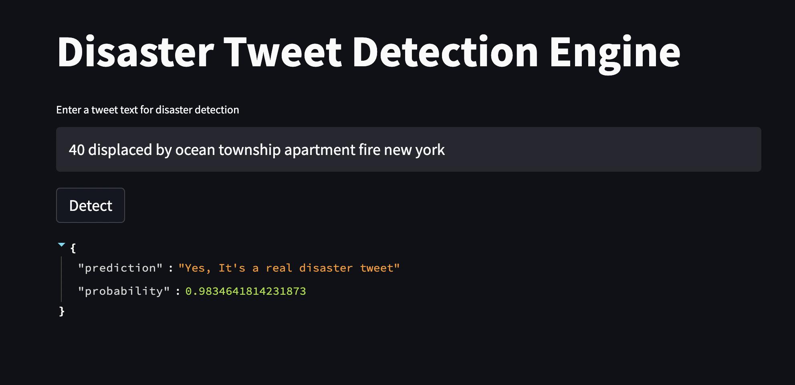

# Acknowledgement 
  At first, we would like to thank Professor Anurag Bhardwaj for teaching us so much about artificial intelligence this semester. This git repository shows our final project for Professor Bhardwaj's CS5100 Foundations of Artificical Intelligence. <br><br>
  
# Summary of files
  **data, model, src** are three folders in our streamlit application. data contains all data file we use in this program. model is used to save the fine-tuned     BERTweet model for the app. We didn't upload the model due to its large size. However, we showed the fine-tuning process below and in our report. src contains all codes in our project.<br><br>
  
# Real Disaster Tweet Detection  
  In this project, we train BERT and BERTweet NLP models to classify disaster tweets and build a web application based on BERTweet, the model with the highest accuracy and F-1 score among models trained by us. This README briefly summarizes steps we take to train the model and build the app. Please read our report in the repository for more details. <br><br>
  We obtain two datasets from 
from [Kaggle's Natural Language Processing with Disaster Tweets](https://www.kaggle.com/c/nlp-getting-started) and [Viktor S's Disaster Tweets dataset on Kaggle](https://www.kaggle.com/vstepanenko/disaster-tweets). 
The training framework is based on huggingface transformers library
while streamlit is used for web UI app. 

## Contributors and distributions of work
Team 4
- Jiameng Sun: 
  - Cleaned 2015 Data
  - Fine-tuned BERT Model
  - Data exploratory analysis and data visualization
    
- Yanwen Duan: 
  - Cleaned 2020 Data
  - Fine-tuned BERTweet Model  
  - Built web app 
 

## Environment Setup
We use python 3.7+ and list other requirements for our application in requirements.txt
```bash
pip install -r requirements.txt
```

## Data Preprocessing
**prepare_training_data.py** is used to combine 2020(Viktor) and 2015(Kaggle) data, then clean and 
generate the final training and test data. 
```bash
cd src
python3 prepare_training_data.py
```
## Data Visualization
**data_visualization_first_modeling.ipynb** is used to clean and visualize the training data. We also fine-tunes the first model (BERT fine-tuned with 2015 train data and tested with the final test data) in the notebook. We train and test the rest of the models as described in the model training section. 

## Model Training and Fine-tuning
Thanks to HuggingFace library and WandB, we create **run_twitter_classification.py** to train and test models. The program enables us to fine-tune models and change models with command line arguments. The modular design of the program improves our efficiency in both training and testing. That's why we fine-tune BERT(new train data) and BERTweet with run_twitter_classification.py instead of data_visualization_first_modeling.ipynb. You can find more details of our fine-tuning process in **twitterclassification.ipynb.**
We fine-tune the models in Google Colab GPU environment.
The training script is adapted and modified from huggingface 
[run_glue.py](https://github.com/huggingface/transformers/blob/master/examples/pytorch/text-classification/run_glue.py)

We also added parameters `freeze_bert_layers` and `freeze_twitter_bert_layers` to freeze encoder layers 
and only fine tune the top head layer.
```jupyterpython
# initializing a wandb to monitor GPU system metrics and model performance
import wandb
wandb.init()
```
Then we run the following training commands.
```bash
# bert: fine tune pretrained bert layers and fine tune head classification layer 
python3 run_twitter_classification.py \
  --model_name_or_path bert-base-uncased \
  --train_file ./joined_train.csv  \
  --validation_file ./joined_test.csv \
  --do_train \
  --do_eval \
  --max_seq_length 128 \
  --per_device_train_batch_size 64 \
  --per_device_eval_batch_size 64 \
  --learning_rate 2e-5 \
  --num_train_epochs 3 \
  --output_dir ./model/ \
  --evaluation_strategy epoch \
  --dataloader_drop_last \
  --overwrite_output_dir \
  --logging_steps 5 \
  --pad_to_max_length False
  
# twitter bert: fine tune pretrained bert layers and fine tune head classification layer 
python3 run_twitter_classification.py \
  --model_name_or_path vinai/bertweet-base \
  --train_file ./joined_train.csv  \
  --validation_file ./joined_test.csv \
  --do_train \
  --do_eval \
  --max_seq_length 128 \
  --per_device_train_batch_size 64 \
  --per_device_eval_batch_size 64 \
  --learning_rate 2e-5 \
  --num_train_epochs 3 \
  --output_dir ./model/ \
  --evaluation_strategy epoch \
  --dataloader_drop_last \
  --overwrite_output_dir \
  --logging_steps 5 \
  --pad_to_max_length False  
```

## Demo App
If you want to run the app on your computer. Download the fine-tued Bertweet model to `model/` folder. The Bertweet model can be fine-tuned based on codes in the Model Training and Fine-tuning section with newtrain.csv as the train dataset and newtest.csv as the test dataset. Then the following script can set up 
a web UI for demo. 
Users can type in a text/tweet and click the `Detect` button to 
check whether it is a real disaster.
```shell
streamlit run twitterbert_app.py
```

